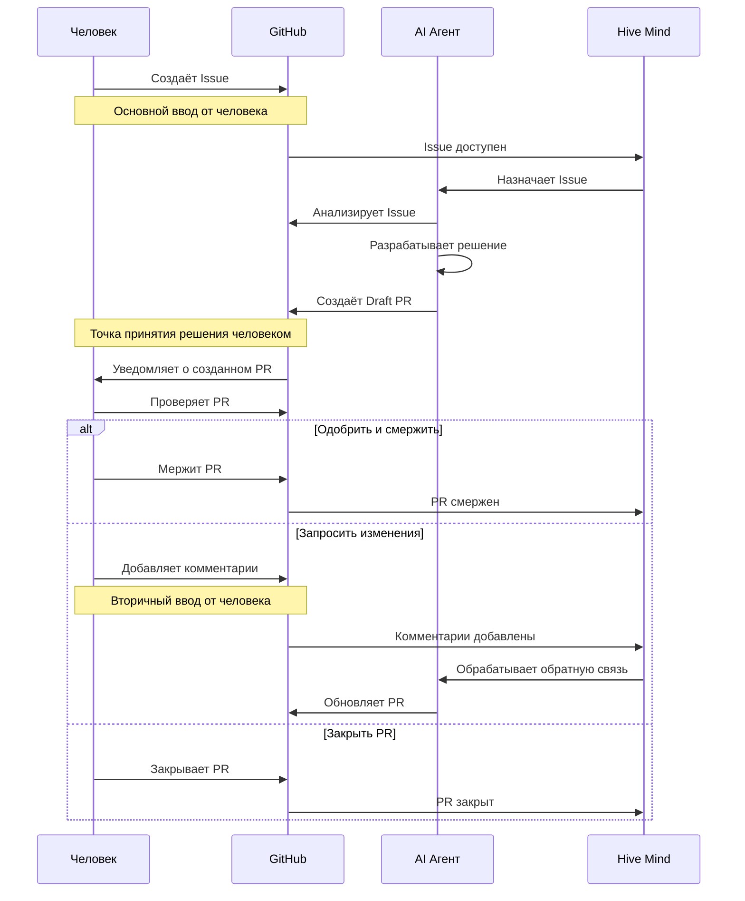
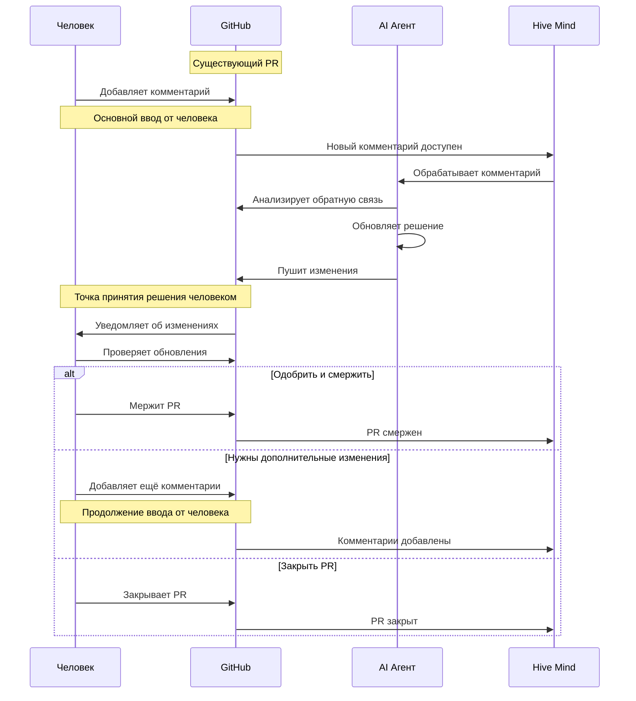

[](https://npmjs.com/@deep-assistant/hive-mind)
[](https://github.com/deep-assistant/hive-mind/blob/main/LICENSE)
[](https://github.com/deep-assistant/hive-mind/stargazers)

[](https://gitpod.io/#https://github.com/deep-assistant/hive-mind)
[](https://github.com/codespaces/new?hide_repo_select=true&ref=main&repo=deep-assistant/hive-mind)

# Hive Mind 🧠 - Руководство по установке на Contabo VPS

**Главный AI-разум, управляющий роем AI-агентов.** Оркестратор AI, контролирующий других AI. HIVE MIND. SWARM MIND.

Эта система также может подключаться к коллективному человеческому интеллекту — взаимодействовать с людьми для сбора требований, экспертизы и обратной связи.

[](https://github.com/konard/problem-solving)

Вдохновлено проектом [konard/problem-solving](https://github.com/konard/problem-solving)

---

## ⚠️ ВАЖНЫЕ ПРЕДУПРЕЖДЕНИЯ О БЕЗОПАСНОСТИ

### ⚠️ НЕ ЗАПУСКАЙТЕ НА РАБОЧЕЙ МАШИНЕ

**ОПАСНО запускать это ПО на вашей основной рабочей машине!**

**ОБЯЗАТЕЛЬНО используйте ОТДЕЛЬНУЮ установку Ubuntu 24.04** (инструкция по установке подготовлена для вас ниже).

Это ПО использует полностью автономный режим Claude Code, что означает свободное выполнение любых команд, которые AI посчитает нужными.

Это может привести к неожиданным побочным эффектам.

Также существует известная проблема утечки дискового пространства. Убедитесь, что вы можете переустановить виртуальную машину для очистки пространства и/или устранения повреждений.

### ⚠️ КРИТИЧНО: Безопасность токенов и чувствительных данных

**ЭТО ПО НЕ МОЖЕТ ГАРАНТИРОВАТЬ БЕЗОПАСНОСТЬ ВАШИХ ТОКЕНОВ ИЛИ ДРУГИХ ЧУВСТВИТЕЛЬНЫХ ДАННЫХ НА ВИРТУАЛЬНОЙ МАШИНЕ.**

Существует бесконечное количество способов извлечь токены из виртуальной машины, подключенной к интернету. Это включает, но не ограничивается:

- **Claude MAX токены** - Необходимы для работы AI
- **GitHub токены** - Необходимы для доступа к репозиториям
- **API ключи и credentials** - Любые чувствительные данные в системе

**ВАЖНЫЕ СООБРАЖЕНИЯ ПО БЕЗОПАСНОСТИ:**

- Запуск на рабочей машине разработчика **АБСОЛЮТНО НЕБЕЗОПАСЕН**
- Запуск на виртуальной машине **МЕНЕЕ ОПАСЕН**, но всё ещё имеет риски
- Даже если данные вашей рабочей машины не подвергаются прямому воздействию, VM всё равно содержит чувствительные токены
- Любой токен, хранящийся в системе, подключенной к интернету, потенциально может быть скомпрометирован

**ИСПОЛЬЗУЙТЕ ЭТО ПО ПОЛНОСТЬЮ НА СВОЙ РИСК И ОТВЕТСТВЕННОСТЬ.**

Мы настоятельно рекомендуем:
- Использовать выделенные, изолированные виртуальные машины
- Регулярно ротировать токены
- Мониторить использование токенов на предмет подозрительной активности
- Никогда не использовать production токены или credentials
- Быть готовыми отозвать и заменить все токены, используемые с этой системой

### Минимальные системные требования для запуска `hive.mjs`

```
1 CPU Core (ядро процессора)
1 GB RAM (оперативной памяти)
> 2 GB SWAP (файл подкачки)
50 GB disk space (дискового пространства)
```

**Рекомендация для Contabo VPS:**
- **VPS S (4 vCore, 8 GB RAM, 100 GB NVMe)** - оптимальный вариант для начала
- **VPS M** или выше - если планируете запускать много параллельных задач

---

## 🚀 Быстрый старт - Установка на сервер Contabo VPS

### Шаг 1: Заказ и настройка Contabo VPS

1. **Зайдите на сайт Contabo**
   - Перейдите на https://contabo.com/
   - Выберите раздел VPS

2. **Выберите тариф**
   - Рекомендуется **VPS S SSD** или выше
   - Убедитесь, что выбрана **Ubuntu 24.04 LTS** как операционная система

3. **Завершите заказ**
   - После оплаты вы получите email с:
     - IP адресом сервера (например: 123.123.123.123)
     - Root паролем
     - SSH портом (обычно 22)

4. **Подключитесь к серверу через SSH**
   ```bash
   # С вашего компьютера (Linux/Mac)
   ssh root@123.123.123.123

   # Или с Windows (используйте PuTTY или Windows Terminal)
   ```

5. **Смените root пароль** (опционально, но рекомендуется)
   ```bash
   passwd
   ```

### Шаг 2: Установка Hive Mind на Ubuntu 24.04

После подключения к серверу выполните следующие шаги:

#### 2.1 Автоматическая установка (рекомендуется)

```bash
# Убедитесь что вы под root пользователем
whoami  # Должно вывести: root

# Запустите скрипт автоматической установки
curl -fsSL -o- https://github.com/deep-assistant/hive-mind/raw/refs/heads/main/scripts/ubuntu-24-server-install.sh | bash
```

**Что делает этот скрипт:**
- Обновляет систему
- Устанавливает Node.js, npm, bun
- Устанавливает GitHub CLI (`gh`)
- Устанавливает Claude Code CLI
- Устанавливает OpenCode AI CLI (с бесплатной моделью Grok)
- Создаёт пользователя `hive` для безопасной работы
- Настраивает окружение

**⚠️ ВАЖНО:** В процессе установки вас попросят авторизоваться через GitHub аккаунт. Это необходимо для работы инструмента `gh`. Система будет выполнять все действия от имени этого GitHub аккаунта.

#### 2.2 Переключение на пользователя `hive`

```bash
# После завершения установки переключитесь на пользователя hive
su - hive

# Проверьте что вы под нужным пользователем
whoami  # Должно вывести: hive
```

#### 2.3 Авторизация Claude Code CLI

Claude Code CLI и OpenCode AI CLI уже установлены предыдущим скриптом. Теперь нужно авторизовать Claude:

```bash
# Запустите команду claude для авторизации
claude
```

**Следуйте инструкциям на экране:**
1. Откроется ссылка для авторизации
2. Войдите в свой Anthropic аккаунт
3. Авторизуйте доступ
4. Вернитесь в терминал - авторизация завершена

**Примечание:** OpenCode на данный момент поставляется с бесплатной моделью **Grok Code Fast 1** по умолчанию - авторизация здесь не требуется.

### Шаг 3: Настройка Telegram бота (опционально)

Telegram бот позволяет управлять Hive Mind удалённо через Telegram.

#### 3.1 Создание бота в Telegram

1. **Откройте Telegram и найдите @BotFather**
   - В Telegram найдите пользователя [@BotFather](https://t.me/BotFather)

2. **Создайте нового бота**
   ```
   Отправьте: /newbot
   Введите имя бота: MyHiveMindBot
   Введите username бота: my_hive_mind_bot
   ```

3. **Получите токен бота**
   - BotFather пришлёт вам токен вида: `849...355:AAG...rgk_YZk...aPU`
   - **СОХРАНИТЕ ЕГО** - он понадобится для запуска

4. **Добавьте бота в группу** (если хотите использовать в группе)
   - Создайте группу в Telegram
   - Добавьте своего бота в группу
   - Сделайте его администратором группы

#### 3.2 Получение Chat ID

Чтобы ограничить доступ к боту, нужно узнать Chat ID:

```bash
# Временно запустите бота БЕЗ ограничений
hive-telegram-bot --token "ваш_токен_от_BotFather"
```

Теперь в Telegram:
- Перейдите в группу где находится бот
- Отправьте команду `/help`
- Бот пришлёт Chat ID (например: -1002975819706)

**Остановите бота:** Нажмите `Ctrl+C` в терминале

#### 3.3 Запуск бота в фоновом режиме

**Вариант 1: Конфигурация через YAML (рекомендуется)**

```bash
# Создайте новую screen сессию для бота
screen -S bot

# Запустите бота с конфигурацией
hive-telegram-bot --configuration "
  TELEGRAM_BOT_TOKEN: '849...355:AAG...rgk_YZk...aPU'
  TELEGRAM_ALLOWED_CHATS:
    -1002975819706
    -1002861722681
  TELEGRAM_HIVE_OVERRIDES:
    --all-issues
    --once
    --auto-fork
    --skip-issues-with-prs
    --attach-logs
    --verbose
    --no-tool-check
  TELEGRAM_SOLVE_OVERRIDES:
    --auto-fork
    --auto-continue
    --attach-logs
    --verbose
    --no-tool-check
  TELEGRAM_BOT_VERBOSE: true
"

# Нажмите CTRL + A, затем D для отсоединения от screen
```

**Вариант 2: Параметры командной строки**

```bash
screen -S bot

hive-telegram-bot --token "849...355:AAG...rgk_YZk...aPU" \
  --allowed-chats "(-1002975819706 -1002861722681)" \
  --hive-overrides "(--all-issues --once --auto-fork --skip-issues-with-prs --attach-logs --verbose --no-tool-check)" \
  --solve-overrides "(--auto-fork --auto-continue --attach-logs --verbose --no-tool-check)" \
  --verbose

# CTRL + A, затем D для отсоединения
```

**Управление screen сессиями:**
```bash
# Посмотреть все screen сессии
screen -ls

# Подключиться к сессии бота
screen -r bot

# Отключиться от сессии (бот продолжит работать)
# Нажмите: CTRL + A, затем D

# Остановить бота
screen -r bot
# Нажмите: CTRL + C
```

### Шаг 4: Авторизация Codex (опционально)

Если вы хотите использовать модели Codex (GPT-5, o3), нужна дополнительная авторизация через SSH туннель.

#### 4.1 Создание SSH туннеля

**На вашем локальном компьютере:**
```bash
# Замените 123.123.123.123 на IP вашего Contabo сервера
ssh -L 1455:localhost:1455 root@123.123.123.123
```

Теперь у вас открыт SSH туннель на порт 1455.

#### 4.2 Запуск авторизации

**На сервере (в SSH сессии):**
```bash
codex login
```

Скрипт запустит OAuth сервер на порту 1455 и выведет ссылку для авторизации.

#### 4.3 Завершение авторизации

1. **Скопируйте ссылку** из вывода `codex login`
2. **Откройте ссылку в браузере на вашем локальном компьютере**
3. Авторизуйтесь в аккаунте Codex
4. Вы будете перенаправлены на `localhost:1455` и увидите сообщение об успешной авторизации
5. В терминале сервера появится `Successfully logged in`

Теперь команда `codex` работает, и вы можете использовать `--tool codex` в командах `solve` и `hive`.

---

## 🔧 Основные операции Hive Mind

### Решение отдельных GitHub Issues

```bash
# Базовое решение issue с автоматическим форком
solve https://github.com/owner/repo/issues/123 --auto-fork

# Решение с максимальной мощностью (модель Opus) и extended thinking
solve https://github.com/owner/repo/issues/123 \
  --auto-fork \
  --auto-continue \
  --attach-logs \
  --verbose \
  --model opus \
  --think max

# Решение с автоматическим продолжением при новых комментариях
solve https://github.com/owner/repo/issues/123 \
  --auto-fork \
  --auto-continue \
  --verbose

# Продолжение работы над существующим Pull Request
solve https://github.com/owner/repo/pull/456 --model opus

# Возобновление сессии Claude после достижения лимита
solve https://github.com/owner/repo/issues/123 --resume session-id
```

### Оркестрация множества issues (Hive режим)

```bash
# Мониторинг одного репозитория по метке "help wanted"
hive https://github.com/owner/repo \
  --monitor-tag "help wanted" \
  --concurrency 3

# Мониторинг всех issues в организации с auto-fork
hive https://github.com/microsoft \
  --all-issues \
  --max-issues 10 \
  --auto-fork

# Однократный запуск (не мониторинг) для всех issues
hive https://github.com/owner/repo \
  --all-issues \
  --once \
  --auto-fork \
  --skip-issues-with-prs

# Автоматическая очистка временных файлов
hive https://github.com/org/repo \
  --auto-cleanup \
  --auto-fork \
  --concurrency 5
```

### Использование через Telegram бота

После запуска бота (см. Шаг 3), вы можете управлять Hive Mind прямо из Telegram.

**Все команды работают только в групповых чатах** (не в личных сообщениях с ботом).

#### Команда `/solve` - Решение GitHub Issues

```
/solve https://github.com/owner/repo/issues/123

/solve https://github.com/owner/repo/issues/123 --auto-fork --verbose

/solve https://github.com/owner/repo/issues/123 \
  --auto-fork \
  --auto-continue \
  --attach-logs \
  --verbose \
  --model sonnet \
  --think max
```

#### Команда `/hive` - Запуск оркестрации

```
/hive https://github.com/owner/repo

/hive https://github.com/owner/repo --all-issues --max-issues 10

/hive https://github.com/microsoft --all-issues --concurrency 3
```

#### Команда `/help` - Справка и диагностика

```
/help
```

Показывает:
- Chat ID (нужен для TELEGRAM_ALLOWED_CHATS)
- Тип чата
- Доступные команды
- Примеры использования

---

## 📋 Основные компоненты

| Скрипт | Назначение | Ключевые возможности |
|--------|-----------|---------------------|
| `solve.mjs` (стабильный) | Решение GitHub issues | Авто-форк, создание веток, генерация PR, возобновление сессий |
| `hive.mjs` (стабильный) | AI оркестрация и мониторинг | Мониторинг множества репозиториев, параллельные воркеры, управление очередью |
| `review.mjs` (alpha) | Автоматизация code review | Совместный AI ревью, автоматическая обратная связь |
| `reviewers-hive.mjs` (alpha/экспериментальный) | Управление командой ревьюеров | Консенсус нескольких агентов, назначение ревьюеров |
| `telegram-bot.mjs` (стабильный) | Telegram бот интерфейс | Удалённое выполнение команд, поддержка групповых чатов, диагностические инструменты |

---

## 🔧 Опции команды `solve`

```bash
solve <issue-url> [опции]

  --model, -m           Модель (sonnet, opus для claude;
                        grok-code-fast-1, gpt4o для opencode;
                        gpt5, gpt5-codex, o3 для codex)
                        [по умолчанию: sonnet для claude,
                         grok-code-fast-1 для opencode, gpt-5 для codex]

  --tool                AI инструмент (claude, opencode, codex)
                        [по умолчанию: claude]

  --fork, -f            Форкнуть репозиторий если нет прав на запись
                        [по умолчанию: false]

  --auto-fork           Автоматически форкнуть публичные репозитории без прав записи
                        (не работает для приватных)
                        [по умолчанию: false]

  --base-branch, -b     Целевая ветка для PR
                        [по умолчанию: default ветка репозитория]

  --resume, -r          Возобновить с session ID

  --verbose, -v         Включить подробное логирование
                        [по умолчанию: false]

  --dry-run, -n         Только подготовка, не выполнять
                        [по умолчанию: false]

  --only-prepare-command  Только подготовить и вывести команду
                        [по умолчанию: false]

  --skip-tool-check     Пропустить проверку подключения инструмента
                        (используйте --no-tool-check чтобы отключить)
                        [по умолчанию: false]

  --auto-pull-request-creation  Создать draft PR перед выполнением
                        [по умолчанию: true]

  --attach-logs         Прикрепить логи к PR (⚠️ могут содержать чувствительные данные)
                        [по умолчанию: false]

  --auto-close-pull-request-on-fail  Закрыть PR при ошибке
                        [по умолчанию: false]

  --auto-continue       Продолжить с существующим PR когда указан URL issue
                        [по умолчанию: false]

  --auto-continue-limit, -c  Автоматически продолжать когда лимит сбросится
                        [по умолчанию: false]

  --auto-resume-on-errors  Автоматически возобновлять при сетевых ошибках (503, и т.д.)
                        [по умолчанию: false]

  --auto-continue-only-on-new-comments  Ошибка если нет новых комментариев
                        [по умолчанию: false]

  --auto-commit-uncommitted-changes  Автоматически коммитить изменения
                        [по умолчанию: false]

  --auto-merge-default-branch-to-pull-request-branch
                        Мержить default ветку в PR ветку
                        (только в режиме продолжения)
                        [по умолчанию: false]

  --allow-fork-divergence-resolution-using-force-push-with-lease
                        Разрешить force-push с --force-with-lease при расхождении форка
                        (ОПАСНО: может перезаписать историю форка)
                        [по умолчанию: false]

  --continue-only-on-feedback  Продолжать только если обнаружена обратная связь
                        [по умолчанию: false]

  --watch, -w           Мониторить обратную связь и автоматически перезапускаться
                        [по умолчанию: false]

  --watch-interval      Интервал проверки обратной связи (секунды)
                        [по умолчанию: 60]

  --min-disk-space      Минимум свободного места на диске в MB
                        [по умолчанию: 500]

  --log-dir, -l         Директория для лог-файлов
                        [по умолчанию: текущая директория]

  --think               Уровень "думания" (low, medium, high, max)
                        [опционально]

  --sentry              Включить отслеживание ошибок через Sentry
                        (используйте --no-sentry чтобы отключить)
                        [по умолчанию: true]

  --auto-cleanup        Удалить временную директорию после завершения
                        [по умолчанию: true для приватных репозиториев,
                         false для публичных]

  --version             Показать версию

  --help, -h            Показать справку
```

---

## 🔧 Опции команды `hive`

```bash
hive <github-url> [опции]

  --monitor-tag, -t     Метка для мониторинга
                        [по умолчанию: "help wanted"]

  --all-issues, -a      Мониторить все issues (игнорировать метки)
                        [по умолчанию: false]

  --skip-issues-with-prs, -s  Пропускать issues с существующими PR
                        [по умолчанию: false]

  --concurrency, -c     Количество параллельных воркеров
                        [по умолчанию: 2]

  --pull-requests-per-issue, -p  Количество PR на один issue
                        [по умолчанию: 1]

  --model, -m           Модель (opus, sonnet для claude;
                        grok-code-fast-1, gpt4o для opencode;
                        gpt5, gpt5-codex, o3 для codex)
                        [по умолчанию: sonnet для claude,
                         grok-code-fast-1 для opencode, gpt-5 для codex]

  --tool                AI инструмент (claude, opencode, codex)
                        [по умолчанию: claude]

  --interval, -i        Интервал опроса (секунды)
                        [по умолчанию: 300]

  --max-issues          Лимит обработанных issues
                        [по умолчанию: 0 (без лимита)]

  --once                Один запуск (не мониторинг)
                        [по умолчанию: false]

  --dry-run             Список issues без обработки
                        [по умолчанию: false]

  --skip-tool-check     Пропустить проверку подключения инструмента
                        (используйте --no-tool-check чтобы отключить)
                        [по умолчанию: false]

  --verbose, -v         Включить подробное логирование
                        [по умолчанию: false]

  --min-disk-space      Минимум свободного места на диске в MB
                        [по умолчанию: 500]

  --auto-cleanup        Очистить /tmp/* /var/tmp/* при успехе
                        [по умолчанию: false]

  --fork, -f            Форкнуть репозитории если нет прав на запись
                        [по умолчанию: false]

  --auto-fork           Автоматически форкнуть публичные репозитории без прав записи
                        [по умолчанию: false]

  --attach-logs         Прикрепить логи к PRs (⚠️ чувствительные данные)
                        [по умолчанию: false]

  --project-number, -pn  Номер GitHub Project для мониторинга

  --project-owner, -po  Владелец GitHub Project (организация или пользователь)

  --project-status, -ps  Колонка статуса проекта для мониторинга
                        [по умолчанию: "Ready"]

  --project-mode, -pm   Включить мониторинг на основе проектов
                        [по умолчанию: false]

  --youtrack-mode       Включить режим YouTrack вместо GitHub
                        [по умолчанию: false]

  --youtrack-stage      Переопределить stage YouTrack для мониторинга

  --youtrack-project    Переопределить код проекта YouTrack

  --target-branch, -tb  Целевая ветка для pull requests
                        [по умолчанию: default ветка репозитория]

  --log-dir, -l         Директория для лог-файлов
                        [по умолчанию: текущая директория]

  --auto-continue       Передавать --auto-continue в solve для каждого issue
                        [по умолчанию: false]

  --think               Уровень "думания" (low, medium, high, max)
                        [опционально]

  --sentry              Включить отслеживание ошибок через Sentry
                        (используйте --no-sentry чтобы отключить)
                        [по умолчанию: true]

  --watch, -w           Мониторить обратную связь и автоматически перезапускаться
                        [по умолчанию: false]

  --issue-order, -o     Сортировка issues по дате (asc, desc)
                        [по умолчанию: asc]

  --version             Показать версию

  --help, -h            Показать справку
```

---

## 🏗️ Архитектура

Hive Mind работает на трёх уровнях:

1. **Уровень оркестрации** (`hive.mjs`) - Координирует множество AI агентов
2. **Уровень выполнения** (`solve.mjs`, `review.mjs`) - Выполняет конкретные задачи
3. **Уровень человеческого интерфейса** - Обеспечивает сотрудничество человека и AI

### Поток данных

#### Режим 1: Issue → Pull Request



#### Режим 2: Pull Request → Комментарии



📖 **Для подробной документации по потоку данных, включая точки интеграции с обратной связью от людей, см. [docs/flow.md](./docs/flow.md)**

---

## 📊 Примеры использования

### Автоматическое решение Issues

```bash
# Авто-форк и решение issue (автоопределение для публичных репо)
solve https://github.com/owner/repo/issues/123 --auto-fork --model opus

# Ручной форк и решение issue (работает для публичных и приватных репо)
solve https://github.com/owner/repo/issues/123 --fork --model opus

# Продолжение работы над существующим PR
solve https://github.com/owner/repo/pull/456 --verbose

# Решение с подробным логированием и прикреплением логов
solve https://github.com/owner/repo/issues/123 --verbose --attach-logs

# Dry run чтобы посмотреть что произойдёт
solve https://github.com/owner/repo/issues/123 --dry-run
```

### Оркестрация множества репозиториев

```bash
# Мониторинг одного репозитория по конкретной метке
hive https://github.com/owner/repo --monitor-tag "bug" --concurrency 4

# Мониторинг всех issues в организации с авто-форком
hive https://github.com/microsoft --all-issues --max-issues 20 --once --auto-fork

# Мониторинг пользовательских репозиториев с высокой параллельностью
hive https://github.com/username --all-issues --concurrency 8 --interval 120 --auto-fork

# Пропуск issues у которых уже есть PRs
hive https://github.com/org/repo --skip-issues-with-prs --verbose

# Авто-очистка временных файлов и авто-форк при необходимости
hive https://github.com/org/repo --auto-cleanup --auto-fork --concurrency 5
```

### Управление сессиями

```bash
# Возобновление когда Claude достигает лимита
solve https://github.com/owner/repo/issues/123 --resume 657e6db1-6eb3-4a8d

# Интерактивное продолжение сессии в Claude Code
(cd /tmp/gh-issue-solver-123456789 && claude --resume session-id)
```

---

## 🔍 Мониторинг и логирование

Найти команды возобновления в логах:

```bash
grep -E '\(cd /tmp/gh-issue-solver-[0-9]+ && claude --resume [0-9a-f-]{36}\)' hive-*.log
```

---

## 🔧 Конфигурация

Аутентификация осуществляется через:
- `gh auth login` - Аутентификация GitHub CLI
- `claude-profiles` - Миграция профиля аутентификации Claude на сервер

На данный момент конфигурация через переменные окружения не поддерживается.

---

## 🐛 Сообщение о проблемах

### Проблемы с Hive Mind

Если вы столкнулись с проблемами в **Hive Mind** (этот проект), пожалуйста сообщите о них на нашей странице GitHub Issues:
- **Репозиторий**: https://github.com/deep-assistant/hive-mind
- **Issues**: https://github.com/deep-assistant/hive-mind/issues

### Проблемы с Claude Code CLI

Если вы столкнулись с проблемами в **Claude Code CLI** (например, ошибки команды `claude`, проблемы установки или баги CLI), пожалуйста сообщите о них в официальный репозиторий Claude Code:
- **Репозиторий**: https://github.com/anthropics/claude-code
- **Issues**: https://github.com/anthropics/claude-code/issues

---

## 🛠️ Диагностика сервера

### Идентификация screen сессий, использующих ресурсы

```bash
TARGETS="62220 65988 63094 66606 1028071 4127023"

# Построение карты PID screen → имя сессии
declare -A NAME
while read -r id; do spid=${id%%.*}; NAME[$spid]="$id"; done \
  < <(screen -ls | awk '/(Detached|Attached)/{print $1}')

# Проверка каждого PID на переменную STY и сопоставление с сессией
for p in $TARGETS; do
  sty=$(tr '\0' '\n' < /proc/$p/environ 2>/dev/null | awk -F= '$1=="STY"{print $2}')
  if [ -n "$sty" ]; then
    spid=${sty%%.*}
    echo "$p  ->  ${NAME[$spid]:-$sty}"
  else
    echo "$p  ->  (нет STY; не из screen или env очищен / double-forked)"
  fi
done
```

### Подробная информация о процессе

```bash
procinfo() {
  local pid=$1
  if [ -z "$pid" ]; then
    echo "Использование: procinfo <pid>"
    return 1
  fi
  if [ ! -d "/proc/$pid" ]; then
    echo "Процесс $pid не найден."
    return 1
  fi

  echo "=== Процесс $pid ==="
  # Базовая информация о процессе
  ps -p "$pid" -o user=,uid=,pid=,ppid=,c=,stime=,etime=,tty=,time=,cmd=

  echo
  # Рабочая директория
  echo "CWD: $(readlink -f /proc/$pid/cwd 2>/dev/null)"

  # Путь к исполняемому файлу
  echo "EXE: $(readlink -f /proc/$pid/exe 2>/dev/null)"

  # Корневая директория процесса
  echo "ROOT: $(readlink -f /proc/$pid/root 2>/dev/null)"

  # Командная строка (полная, raw)
  echo "CMDLINE:"
  tr '\0' ' ' < /proc/$pid/cmdline 2>/dev/null
  echo

  # Переменные окружения
  echo
  echo "ENVIRONMENT (key=value):"
  tr '\0' '\n' < /proc/$pid/environ 2>/dev/null | head -n 20

  # Открытые файлы (первые несколько)
  echo
  echo "OPEN FILES:"
  ls -l /proc/$pid/fd 2>/dev/null | head -n 10

  # Дочерние процессы
  echo
  echo "CHILDREN:"
  ps --ppid "$pid" -o pid=,cmd= 2>/dev/null
}

# Пример использования
procinfo 62220
```

---

## 🧹 Обслуживание сервера

### Закрытие всех screen сессий для освобождения RAM

```bash
# Закрыть все (Attached или Detached) сессии
screen -ls | awk '/(Detached|Attached)/{print $1}' \
| while read s; do screen -S "$s" -X quit; done

# Удалить любые zombie сокеты
screen -wipe

# Проверка
screen -ls
```

### Очистка дискового пространства

```bash
# Проверить текущее использование диска
df -h

# ВНИМАНИЕ: Удаляет ВСЁ из /tmp (будьте осторожны!)
rm -rf /tmp/*

# Проверить освобождённое место
df -h
```

### Перезагрузка сервера

```bash
sudo reboot
```

---

## 🔒 Рекомендации по безопасности для Contabo VPS

### 1. Настройка Firewall

```bash
# Установка UFW (Uncomplicated Firewall)
apt-get update
apt-get install -y ufw

# Разрешить SSH (ВАЖНО: сделать до включения firewall!)
ufw allow 22/tcp

# Включить firewall
ufw enable

# Проверить статус
ufw status
```

### 2. Отключение root SSH (опционально, после настройки hive пользователя)

```bash
# Редактировать SSH конфиг
nano /etc/ssh/sshd_config

# Найти строку:
# PermitRootLogin yes

# Изменить на:
# PermitRootLogin no

# Перезапустить SSH
systemctl restart sshd
```

### 3. Регулярная ротация токенов

Рекомендуется регулярно обновлять:
- GitHub токены (через `gh auth login`)
- Anthropic API ключи (через `claude` переавторизацию)
- Telegram bot токены (если используются)

### 4. Мониторинг использования токенов

Проверяйте использование ваших API ключей:
- Anthropic Console: https://console.anthropic.com/
- GitHub Settings: https://github.com/settings/tokens

---

## 📄 Лицензия

Unlicense License - см. [LICENSE](./LICENSE)

---

## 🤖 Участие в разработке

Этот проект использует AI-driven разработку. См. [CONTRIBUTING.md](./docs/CONTRIBUTING.md) для руководства по сотрудничеству человека и AI.

---

## 🆘 Часто задаваемые вопросы (FAQ)

### Как узнать что бот работает?

```bash
# Проверить запущенные screen сессии
screen -ls

# Подключиться к сессии бота
screen -r bot

# Вы увидите логи работы бота
```

### Как остановить бота?

```bash
# Подключиться к сессии
screen -r bot

# Нажать CTRL + C для остановки

# Или убить сессию извне
screen -S bot -X quit
```

### Что делать если закончилось место на диске?

```bash
# Посмотреть использование диска
df -h

# Очистить временные файлы Hive Mind
rm -rf /tmp/gh-issue-solver-*

# Очистить /tmp полностью (ОСТОРОЖНО!)
rm -rf /tmp/*

# Посмотреть большие файлы
du -sh /* | sort -h
```

### Как посмотреть логи работы?

```bash
# Логи в текущей директории
ls -lh *.log

# Читать лог-файл
tail -f hive-*.log

# Или
less solve-*.log
```

### Бот не отвечает в Telegram - что делать?

1. Проверьте что бот запущен: `screen -ls`
2. Убедитесь что команды отправляются в групповой чат (не в личку)
3. Проверьте что Chat ID в списке разрешённых (если используется `TELEGRAM_ALLOWED_CHATS`)
4. Посмотрите логи бота: `screen -r bot`

### Как обновить Hive Mind до новой версии?

```bash
# Если установлено через npm/bun globally
npm update -g @deep-assistant/hive-mind

# Или
bun update -g @deep-assistant/hive-mind

# Проверить версию
solve --version
hive --version
```

---

## 📞 Поддержка

Если у вас возникли вопросы по установке на Contabo VPS или использованию Hive Mind:

1. **GitHub Issues**: https://github.com/deep-assistant/hive-mind/issues
2. **Основной репозиторий**: https://github.com/deep-assistant/hive-mind
3. **Telegram канал**: https://t.me/hive_mind_pull_requests

---

**Успешной установки Hive Mind на ваш Contabo VPS! 🚀🧠**
