# Документация потоков данных Hive Mind

Этот подробный документ описывает поток данных в Hive Mind, явно выделяя все точки, где обратная связь от человека интегрируется в рабочий процесс системы.

## Оглавление

1. [Обзор](#обзор)
2. [Режимы работы](#режимы-работы)
3. [Архитектура потока данных](#архитектура-потока-данных)
4. [Режим 1: Режим по умолчанию](#режим-1-режим-по-умолчанию-issue--pull-request)
5. [Режим 2: Режим продолжения](#режим-2-режим-продолжения-pull-request--комментарии)
6. [Точки интеграции обратной связи от человека](#точки-интеграции-обратной-связи-от-человека)
7. [Опции конфигурации](#опции-конфигурации)
8. [Обработка ошибок и резервные варианты](#обработка-ошибок-и-резервные-варианты)
9. [Детали реализации](#детали-реализации)
10. [Итоги](#итоги)

## Обзор

Hive Mind — это AI-powered система совместной разработки, которая работает через GitHub, поддерживая контроль человека в критических точках принятия решений, автоматизируя разработку решений. Система обеспечивает центральную роль обратной связи от человека в процессе разработки через множество точек интеграции.

## Режимы работы

Hive Mind работает в двух основных режимах в зависимости от точки входа и паттернов взаимодействия с человеком:

| Режим | Точка входа | Основной ввод от человека | Вторичный ввод | Точки принятия решений |
|------|------------|-------------------|-----------------|-----------------|
| **Режим по умолчанию** | GitHub Issue | Описание и требования issue | Комментарии к PR для уточнений | Merge/Request Changes/Close |
| **Режим продолжения** | Существующий PR | Комментарии к PR с обратной связью | Дополнительные комментарии к PR | Merge/Request Changes/Close |

## Архитектура потока данных

### Высокоуровневая системная архитектура


### Детальный поток данных


## Режим 1: Режим по умолчанию (Issue → Pull Request)

### Точки обратной связи от человека
- **Основной ввод**: Описание и требования GitHub Issue
- **Точка решения**: Merge, запрос изменений или закрытие PR
- **Вторичный ввод**: Комментарии к PR для уточнений

### Диаграмма последовательности


### Шаги потока данных
1. **Человек создает GitHub issue** (Основной ввод от человека)
2. Hive Mind обнаруживает и назначает issue AI агенту
3. AI агент анализирует требования issue
4. AI агент разрабатывает решение и создает draft PR
5. **Человек проверяет PR** (Точка решения человека)
6. **Человек решает**: Merge, запрос изменений или закрытие (Обратная связь от человека)
7. Если запрошены изменения, цикл продолжается с комментариями к PR как вводом

## Режим 2: Режим продолжения (Pull Request → Комментарии)

### Точки обратной связи от человека
- **Основной ввод**: Комментарии к существующему PR
- **Точка решения**: Та же что и в Режиме 1 (merge, запрос изменений или закрытие)
- **Триггер**: Новые комментарии или обнаружение обратной связи

### Диаграмма последовательности


### Шаги потока данных
1. **Человек добавляет комментарий к существующему PR** (Основной ввод от человека)
2. Hive Mind обнаруживает новый комментарий
3. AI агент обрабатывает комментарий и обратную связь
4. AI агент обновляет решение на основе обратной связи
5. AI агент пушит изменения в PR
6. **Человек проверяет обновления** (Точка решения человека)
7. **Человек решает**: Merge, добавить еще комментарии или закрыть (Обратная связь от человека)
8. Цикл продолжается до разрешения

## Точки интеграции обратной связи от человека

### Полная матрица точек обратной связи

| Точка обратной связи | Режим | Время | Тип ввода | Реакция системы | Уровень влияния |
|---------------|------|---------|------------|-----------------|--------------|
| **Создание Issue** | По умолчанию | Начальное | Требования, описание | Триггерит разработку решения | Высокий - Определяет весь scope |
| **Комментарии к Issue** | По умолчанию | Текущее | Уточнения, обновления | Обновляет требования | Средний - Уточняет scope |
| **Проверка создания PR** | Оба | После draft | Начальная оценка | Определяет продолжение | Высокий - Решение Go/No-go |
| **Комментарии к PR** | Оба | Итеративное | Техническая обратная связь | Триггерит обновления кода | Высокий - Направляет изменения |
| **Code Review** | Оба | На коммит | Построчная обратная связь | Точные модификации | Средний - Конкретные исправления |
| **Одобрение PR** | Оба | Финальное | Решение о принятии | Разрешает merge | Критический - Финальный шлюз |
| **Отклонение PR** | Оба | Любое время | Сигнал остановки | Останавливает процесс | Критический - Полная остановка |
| **Изменения меток** | Оба | Любое время | Обновления приоритета/статуса | Корректирует подход | Низкий - Подсказки процесса |

### 1. Создание Issue (Вход в Режим 1)
- **Тип**: Спецификация требований
- **Формат**: Описание GitHub issue, метки, начальные комментарии
- **Влияние**: Определяет scope и требования для решения AI
- **Доступные действия человека**:
  - Написать детальные требования
  - Прикрепить примеры или спецификации
  - Установить метки приоритета
  - Назначить конкретным агентам
  - Связать связанные issues

### 2. Проверка и решение по PR (Оба режима)
- **Тип**: Решение об одобрении/отклонении
- **Формат**: Merge PR, закрытие или действия с комментариями
- **Влияние**: Определяет приемлемо ли решение или нужно уточнение
- **Доступные действия человека**:
  - Одобрить и смержить
  - Запросить изменения с конкретной обратной связью
  - Закрыть без мержа
  - Конвертировать в draft
  - Назначить дополнительных ревьюеров

### 3. Комментарии к PR (Основной для Режима 2, вторичный для Режима 1)
- **Тип**: Конкретная обратная связь и запросы изменений
- **Формат**: Комментарии к GitHub PR с техническими деталями
- **Влияние**: Направляет уточнения и итерации AI агента
- **Доступные действия человека**:
  - Построчные комментарии к коду
  - Общая беседа по PR
  - Предложить конкретные изменения
  - Запросить тесты или документацию
  - Попросить уточнения

### 4. Непрерывный мониторинг (Оба режима)
- **Тип**: Текущий надзор
- **Формат**: Изменения статуса PR, дополнительные комментарии
- **Влияние**: Позволяет итеративные циклы улучшения
- **Доступные действия человека**:
  - Мониторить результаты CI/CD
  - Проверять результаты автоматических тестов
  - Проверять метрики качества кода
  - Валидировать против требований
  - Предоставлять текущее руководство

### 5. Точки экстренного вмешательства
- **Тип**: Критическая обратная связь
- **Формат**: Прямые команды в комментариях
- **Влияние**: Немедленная реакция системы
- **Триггеры**:
  - Команда `STOP` в комментарии
  - Закрытие PR
  - Активация защиты ветки
  - Ручной откат

### Поток обработки обратной связи от человека


## Опции конфигурации

### Поведение автоматического продолжения
- `--auto-continue`: Автоматически продолжать с существующими PR для issues
- `--auto-continue-only-on-new-comments`: Продолжать только если обнаружены новые комментарии
- `--continue-only-on-feedback`: Продолжать только если обратная связь присутствует

### Контроль взаимодействия с человеком
- `--auto-pull-request-creation`: Создать draft PR перед проверкой человеком
- `--attach-logs`: Включить детальные логи для проверки человеком
- Требование ручного мержа обеспечивает надзор человека

## Обработка ошибок и резервные варианты

### Когда обратная связь от человека отсутствует
- Система ждет ввода вместо продолжения
- Draft PR остаются в статусе draft до действия человека
- Функции автоматического продолжения уважают требования обратной связи

### Когда обратная связь от человека неоднозначна
- AI запрашивает уточнение через комментарии к PR
- Множество вариантов решений для выбора человеком
- Консервативный подход при наличии неопределенности

## Детали реализации

### Интерфейс командной строки

Система предоставляет различные опции командной строки для контроля взаимодействия с обратной связью от человека:

```bash
# Режим по умолчанию - Issue в PR
./solve.mjs "https://github.com/owner/repo/issues/123"

# Режим продолжения - PR с комментариями
./solve.mjs "https://github.com/owner/repo/pull/456"

# Автоматическое продолжение с обнаружением обратной связи
./solve.mjs "https://github.com/owner/repo/issues/123" \
  --auto-continue \
  --auto-continue-only-on-new-comments

# Продолжать только когда обратная связь присутствует
./solve.mjs "https://github.com/owner/repo/pull/456" \
  --continue-only-on-feedback
```

### Алгоритм обнаружения обратной связи

```mermaid
flowchart TD
    A[Начало проверки обратной связи] --> B{Проверка PR/Issue}
    B --> C[Получить комментарии]
    C --> D[Получить время последнего коммита]
    D --> E{Комментарии после коммита?}

    E -->|Да| F[Подсчитать новые комментарии]
    E -->|Нет| G[Нет новой обратной связи]

    F --> H{Тип обратной связи}
    H -->|Техническая| I[Обработать техническую обратную связь]
    H -->|Вопрос| J[Обработать уточнение]
    H -->|Одобрение| K[Обработать одобрение]

    I --> L[Генерировать изменения]
    J --> M[Запросить информацию]
    K --> N[Продолжить к мержу]

    G --> O{Настройки режима продолжения}
    O -->|Принудительное продолжение| P[Продолжить в любом случае]
    O -->|Требуется обратная связь| Q[Выход с сообщением]

    L --> R[Push обновлений]
    M --> R
    N --> S[Завершено]
    P --> R
    Q --> T[Ждать ввода от человека]
```



### Управление состоянием

Система поддерживает состояние между сессиями для обеспечения непрерывности:

| Элемент состояния | Хранилище | Назначение | Постоянство |
|--------------|---------|---------|-------------|
| ID сессии | Файловая система | Отслеживать контекст беседы | До завершения |
| Номер PR | Память/Аргументы | Связывать issue с PR | Время выполнения |
| История комментариев | GitHub API | Отслеживать новую vs старую обратную связь | Постоянное |
| История коммитов | Git | Определять время обратной связи | Постоянное |
| Конфигурация | CLI аргументы | Контролировать поведение | На выполнение |

## Итоги

### Ключевые принципы дизайна

1. **Человеко-центричный**: Каждое автоматическое действие подлежит проверке и одобрению человеком
2. **Управляемый обратной связью**: Система динамически реагирует на ввод человека в множестве точек
3. **Прозрачный**: Все действия AI видимы через стандартные интерфейсы GitHub
4. **Итеративный**: Поддерживает множество раундов уточнения на основе обратной связи человека
5. **Настраиваемый**: Поведение можно адаптировать к рабочим процессам команды

### Резюме потока данных

Архитектура потока данных Hive Mind обеспечивает всесторонний надзор человека через:

- **Множество точек входа**: Issues (Режим по умолчанию) или PRs (Режим продолжения)
- **Непрерывная интеграция обратной связи**: Комментарии обрабатываются в реальном времени
- **Четкие шлюзы решений**: Требуется явное одобрение человека для мержа
- **Экстренные элементы управления**: Возможности немедленной остановки через команды
- **Гибкая конфигурация**: Настраиваемые уровни автоматизации

### Интеграция обратной связи от человека

| Режим | Основная обратная связь | Вторичная обратная связь | Полномочия решения |
|------|-----------------|-------------------|-------------------|
| **Режим по умолчанию** | Требования issue | Комментарии к PR | Решение о мерже человеком |
| **Режим продолжения** | Комментарии к PR | Дополнительные комментарии | Решение о мерже человеком |

Оба режима поддерживают полномочия человека в критических решениях, используя AI для реализации, обеспечивая что обратная связь от человека остается краеугольным камнем процесса разработки.
